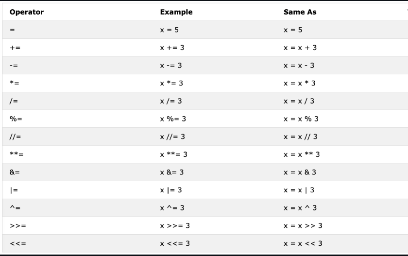

# Day 3

## Boolean

A boolean data type: one of two values
    - True 
    - False

## Operators

### Assignment:

Assignment operators are used to assign values to variables

Example: `=` 
    - This means we are storing a value in a certain variable (assignment)



### Arithmetic Operators: 
    - Addition [+]
    - Subtraction [-]
    - Multiplication [*]
    - Division [/]
    - Modulus [%]
    - Exponential [**]
    - Floor division [//]

### Comparison Operators: 
    - Equal [==]
    - Not equal [!=]
    - Greater than [>]
    - Less than [<]
    - Greater than or equal to [>=]
    - Less than or equal to [<=]

### Logical Operators:
| Operator | Description                             |
|:--       |:--                                      |
|and       |`True` if both statements `True`         |
|or        |`True` if one of the statements is `True`|
|not       |Reverse the result                       |

# Mistakes: 
Your original issue is here:

```python
base: float = input("Enter base: ")
```

The `: float` part is only a type hint. It does not convert the input to a float. input() always returns a string, so you need:

```python
base = float(input("Enter base: "))
```
